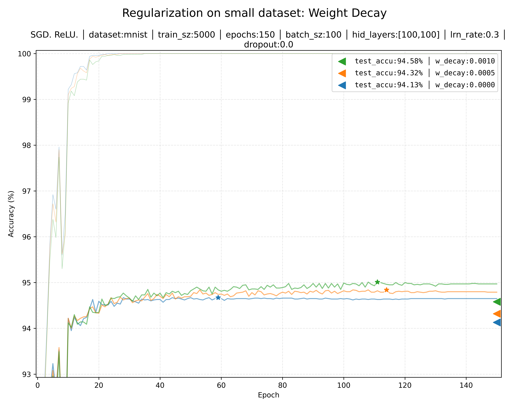
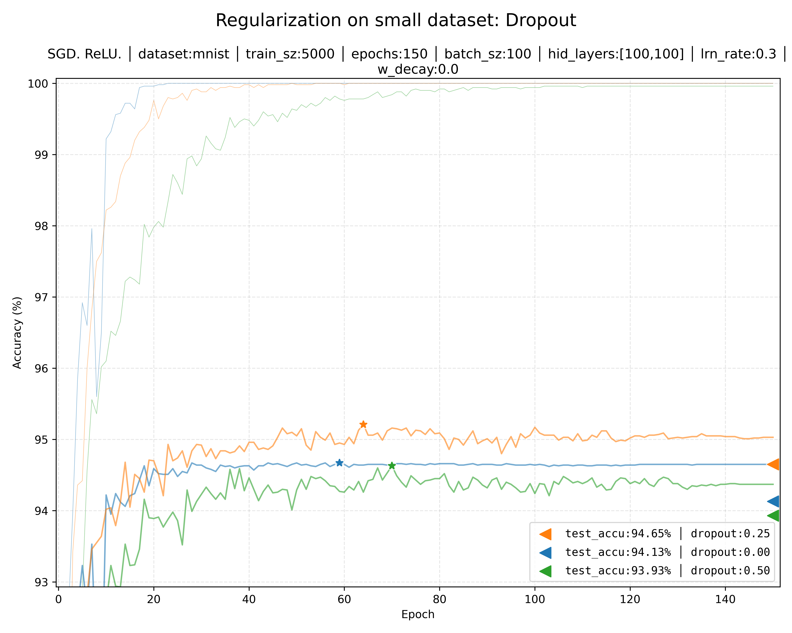
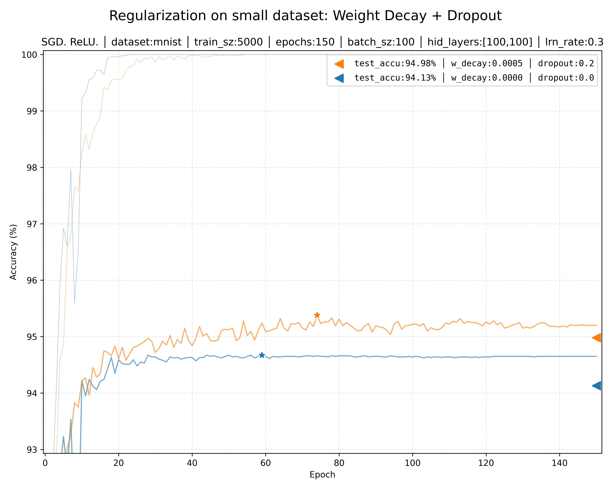
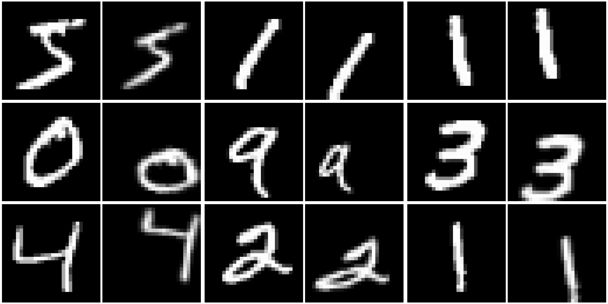
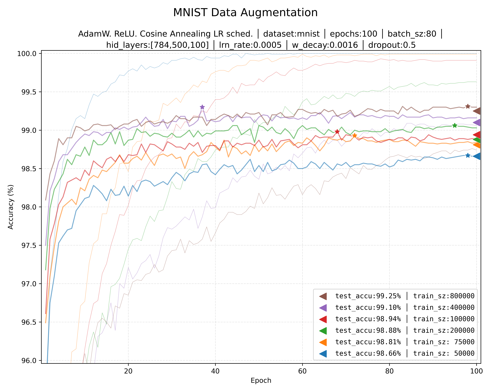
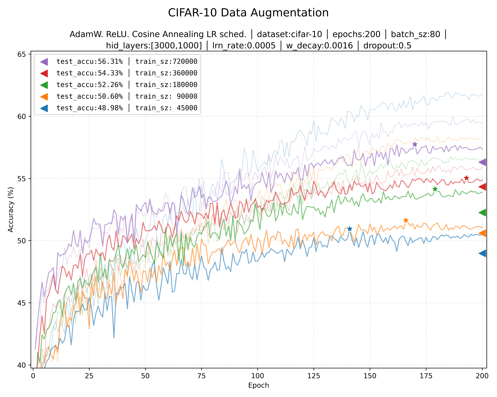

# Neural Networks, From Scratch to Framework

A learning project that intends to evolve from a simple neural network built from scratch, to a PyTorch based framework.

1. [Results](#results)
2. [Running the code](#running-the-code)
3. [Changelog Summary](#changelog-summary)
4. [System Setup](#system-setup)


## Results
| Dataset  | Fully Connected |
|----------|-----------------|
| MNIST    | **99.25%**      |
| CIFAR-10 | **56.31%**      |

### Weight decay and Dropout
Regularization techniques, in general, disencourage complex models that rely on specific features, activations, or weights; in an attempt to avoid memorizing the training data (overfitting) and actually produce a model that is more general.

In order to overfit the training data and see the effects of regularization, let's trim it to 5000 samples. With no weight decay or dropout (blue), training accuracy quickly  reaches 100% (thin line), but validation accuracy (thicker line) peak at 94.67% (star marker); resulting in the final test accuracy of 94.13% (triangle marker).

Each, weight decay and dropout help to reduce the gap between train and validation accuracy. But combined, they make the model generalize even better.





### Data augmentation
Train data can be augmented by introducing small alterations to the original train dataset. Below, 9 input samples of MNIST and CIFAR-10 with some random alterations at their right. Made with the `kornia` python module.
Different augmentations make sense for different scenarios: in gray-scale character recognition you don't want to flip the image or alter the colors, but in photos, that is a reasonable augmentation.



The following plot shows the training of a fully connected network on MNIST, using AdamW with Cosine Annealing LR scheduling. Using only the original dataset of 50K samples yields a 98.66% accuracy (blue line). Augmenting the data improves accuracy; particularly, when augmented 16x, a 99.25% accuracy is obtained.


Here is the same fully connected architecture training on CIFAR-10. The original dataset (50K - 5K validation samples) shows 48.98% test accuracy. A 16x data augmentation improves it to 56.31%. Although a convolutional model is a much better architecture for image classification, artificially augmenting the training data is a powerful tool.


## Running the code
Place the `mnist.plk.gz` file at the root directory of this repo (you can get mnist [from here](https://github.com/mnielsen/neural-networks-and-deep-learning/raw/refs/heads/master/data/mnist.pkl.gz)), activate the conda environment (see [System Setup](#system-setup) section), and then run the main file.

``` shell
$ ls mnist.pkl.gz
mnist.pkl.gz
$ conda activate torch-xpu
$ python main.py 

XPU AVAILABLE: True

LOADING DATA: cifar-10
Augmenting Dataset: 16.0x...............
Training:(X,Y):
    X    torch.float32   [720000, 3, 32, 32]
    Y      torch.int32   [720000, 1]
Validation:(X,Y):
    X    torch.float32   [5000, 3, 32, 32]
    Y      torch.int32   [5000, 1]
Test:(X,Y):
    X    torch.float32   [10000, 3, 32, 32]
    Y      torch.int32   [10000, 1]

CREATING MODEL

TRAINING
  epochs     : 200
  batch_sz   : 80
  hid_layers : [3000, 1000]
  lrn_rate   : 0.0005
  w_decay    : 0.0016
  betas      : (0.9, 0.999)
  dropout    : 0.5
Epoch   1: tra: 41.77%   val: 41.25% <-- new best!
Epoch   2: tra: 43.23%   val: 43.45% <-- new best!
Epoch   3: tra: 43.43%   val: 45.08% <-- new best!
Epoch   4: tra: 45.89%   val: 46.65% <-- new best!
Epoch   5: tra: 44.98%   val: 45.48%
Epoch   6: tra: 45.89%   val: 46.47%
Epoch   7: tra: 46.09%   val: 47.44% <-- new best!
Epoch   8: tra: 47.06%   val: 47.56% <-- new best!
...
Epoch 170: tra: 59.46%   val: 57.74% <-- new best!
...
Epoch 192: tra: 59.58%   val: 57.46%
Epoch 193: tra: 59.80%   val: 57.50%
Epoch 194: tra: 59.74%   val: 57.34%
Epoch 195: tra: 59.48%   val: 57.30%
Epoch 196: tra: 59.74%   val: 57.32%
Epoch 197: tra: 59.42%   val: 57.36%
Epoch 198: tra: 59.54%   val: 57.42%
Epoch 199: tra: 59.52%   val: 57.54%
Epoch 200: tra: 59.44%   val: 57.36%

SAVING PLOT DATA: plots/12_cifar10_augmentation_056.31__0411-142449.json

PLOTTING ALL 'plots/12_cifar10_augmentation_*.json' FILES.
```

## Changelog Summary
- Version 7.0.0:
  - Split code into `main.py` and `nnfw.py` (Neural Network framework)
  
  - **Activation function, regularization, and optimization loop**:
    - Replaced sigmoid activation for ReLU (faster math, and does not saturate, while still introducing non-linearity)
    - Add Weight decay only for weights (not for biases), and Dorpout.
    - Learning Rate Scheduling (Cosine Annealing).
    - Replace stochastic gradient descent with AdamW.

  - **Data augmentation and sample exporting**:
    - Add manual data augmentation though Kornia library. Including randomized: elastic deformations, corp, horizontal flip, affine transformation, and color variations.
    - Specify a multiplier factor to augment (or trim) the original training data, which is shuffled and kept as the training dataset. (Validation and test data never augmented or shuffled.) This makes each augmentation be visited once per epoch.
    - Augmentation is performed once, and results are kept in-memory, avoiding online computation at the expense of memory.
    - `Loader._export_img()`: Original and Augmented images are exported and drawn side by side.
    
  - **Generalization of Data Loader and Model**:
    - Generalize `Loader` class for common Loader interface and add `MnistLoader` and `CifarLoader` ([CIFAR-10](https://www.cs.toronto.edu/~kriz/cifar-10-python.tar.gz)) subclasses.
    - Generalize neural network model class `Module(nn.Module)` so subclasses only need to implement an updated `__init__()`, `forward()` and `fit()`.

  - **Training monitoring and checkpoint**:
    - Monitor validation accuracy, tracking best performing set of parameters (checkpoint); and applying final parameters restoration.
    - Add network collapse detection.

  - **Training plots**:
    - Add training, validation, and testing plot production.
    - Save training log data (metadata and train/validation/test accuracy values) for multi-training comparative training (in JSON format)
    - Multi-train plots group common hyperparameters into the plot's title and add only contrasting values to legend.

- [Version 6.0.0](../../tree/v6.0.0):
  - Replaces Mean Square Error with Cross Entropy, so model shows steeper gradients when "confidently wrong". This is evidenced by the model quickly learning at the beginning of the training, reaching its plateau at as early as epoch 17.

- [Version 5.0.0](../../tree/v5.0.0):
  - Replace manual tensor handling of model's layers with `torch.nn.ModuleList` and `nn.Linear`.
  - Replace manual (and freely named) `NeuralNetwork._feedforward` method with specific `.forward()` method that integrates with torch system.
  - Replace manual xavier and zero initializations with in-place `torch.init.xavier_` and `.zero_`, respectively.
  - Replace manual stochastic gradient descent with `torch.optim.SGD`. As a consequence, updating the model's parameters simplifies to `sgd.step()`

- [Version 4.0.0](../../tree/v4.0.0):
  - Replace manual backpropagation with Torch Autograd.
  - Now training memory is managed by Autograd.

- [Version 3.0.0](../../tree/v3.0.0):
  - Parallel batched training. As a result, the model trains significantly faster than the previous version.
  - Separates memory required for evaluation and training modes, introducing a `Workspace` class that allocates training space only during training.

- [Version 2.0.0](../../tree/v2.0.0):
  - Migrate tensors from NumPy to PyTorch.
  - Use XPU (Intel) for the first time!
  - Profile CPU and XPU activity.

- [Version 1.0.0](../../tree/v1.0.0):
  - Manual backpropagation, forward pass, stochastic gradient descent, and parameters update.
  - Only depends on NumPy.
  - Efficient memory usage: It re-utilizes pre-allocated buffers to avoid alloc/free requests during training.
  - Pluggable interface to define different activation, decision and loss functions.


## System Setup
I am using an Intel Arc Pro B50 (on Fedora). If using CPU, or other graphic card, then you may want to setup things by yourself.

**Note:** You may need to to reboot your computer and dig into the UEFI settings. Make sure your UEFI setting "Large BAR" is enabled. Intel says the option might be labeled "Re-Size BAR" or "Smart Access Memory" depending on your motherboard maker.

**Note 2:** As of February 2026, with kernel 6.18 [there was a bug](https://github.com/pytorch/pytorch/issues/172934) that broke things when moving data from the device to the cpu . You can avoid the issue by using kernel 6.17.

### XPU Drivers and system packages
``` shell
$ sudo dnf install clinfo intel-gpu-tools intel-compute-runtime oneapi-level-zero intel-gpu-tools

# check that you actually have the card 
$ ls -l /dev/dri/
total 0
drwxr-xr-x. 2 root root         80 Jan 23 16:22 by-path/
crw-rw----+ 1 root video  226,   0 Mar 26 09:14 card0
crw-rw-rw-. 1 root render 226, 128 Mar 23 12:00 renderD128

# add yourself to the render and video groups
$ sudo usermod -aG render,video $USER

# re-login or just reboot
$ sudo reboot
```


### Install Conda
``` shell
# Download conda
$ curl -O https://repo.anaconda.com/miniconda/Miniconda3-latest-Linux-x86_64.sh

# install and follow prompts. Allow init
$ bash Miniconda3-latest-Linux-x86_64.sh

# if using bash, re-source the runtime config. (use equivalent for other shells)
source ~/.bashrc

# verify conda
conda --version

```

### Conda environment, and setup testing
```shell
# go to this repo directory
$ cd path/to/this/repo

# take a look at the provided conda environment specification 
$ cat conda-environment.yml

# then, actually create the environment
$ conda env create -f conda-environment.yml

# activate it
$ conda activate torch-xpu
```
